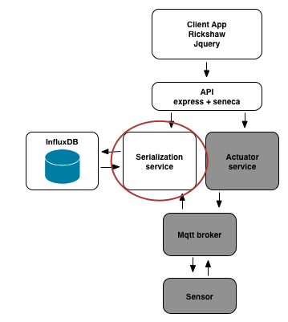

# Step 1

## Solution to step 0

1. The container can be started with `docker run -d -p 8083:8083 -p 8086:8086 tutum/influxdb`
2. The file step1/services/influx/run.sh contains the command to start the influx container for your convenience.
3. Run `docker-machine ip default` to obtain the docker-machine ip address
4. Point your browser to http://\<dockermachineip\>:8083/ to open the influx console

The `-p` argument exposes ports 8083 and 8086 from the container to the host. The `-d` argument tells docker to run the container in [detached mode](https://docs.docker.com/engine/reference/run/#detached-d).

Note that when using docker locally, you are always dealing with a separate VM, with it's own IP address (at least on Mac and Windows).

You can stop the container at any time by using the `docker kill` command.

## Challenge


Now that we have our database running, we are going to create a micro-service to read and write to it. A serialization service has been created for you in step1/services/serializer.

Your challenge is to write a small script to start this process up and use it to write temperature values into influx DB. Once the service is up and running you can use the following command to send data points to the service.

```sh
curl -X POST -d "{\"role\": \"serialize\", \"cmd\": \"write\", \"sensorId\": \"1\", \"temperature\": 32}" http://localhost:10000/act  --header "Content-Type:application/json"
```

__hint__ If you look at the code in `serializer.js` you will notice that it uses the folling environment variables:

* INFLUX_HOST
* serializer_PORT

Your startup script will need to set these variables to the correct values.

You can check that the data points are indeed written to influx by pointing your browser to the influx web interface and running this query:

```
use temperature;
select * from temperature;
```

## Next Up [step2](../step2/README.md)
