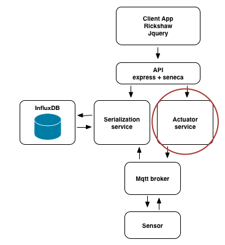

# Step 5

## solution to step 4

1. the folder step5/fuge contains an updated fuge configuration
2. start fuge up by running `fuge shell fuge/compose-dev.yml`
3. start the system in the shell by running `start all`
4. open http://localhost:10001 to view the data points
5. data is now streaming from the sensor through the broker to the serialization
service and being displayed on the front end

## Challenge

For the final service in our system your challenge is to wire up the actuator
micro-service. The actuator service is provided for you in
step5/services/actuator.

The actuator service will send an offset message to the sensor via the MQTT
broker. To enable the actuator you will need to add an entry into the fuge
configuration file `compose-dev.yml` as before

__Note__: A button and input field have been provided on the front end to call
the `/set` route for you.

Once you have your config ready, restart the system and point your browser to
the front end. You should see data flowing as before but now you should be able
to send an offset message and see the chart change in real time.

## Next Up [step6](../step6/README.md)
